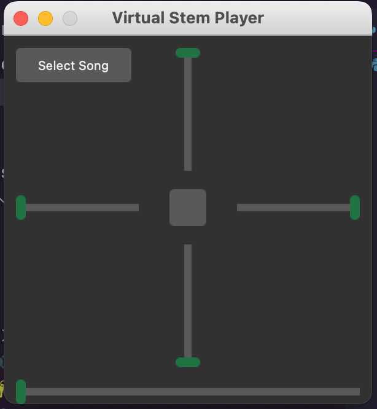

# VirtualStemPlayer

### Description

Split music into stems providing a way listen to music in a different way, with just some elements of a song.

### Requirements

- Python >= 3.6 and <= 3.9
- Tkinter
- Spleeter

```
pip install tk
pip install spleeter
```

### Tkinter themes
- Using forest-dark
- Forest-light files included


## Usage



(First use will take some time to first initialize, since it needs to download pre_trained modules)

1. Click on "Select Song"
2. Wait for confirmation dialog
3. Song will start playing
4. Middle button play/pauses song
5. Bottom slider controls music position

- Upper slider: Controls voice volume
- Left slider: Controls drums volume
- Right slider: Controls bass volume
- Bottom slider: Controls 'others' volume 