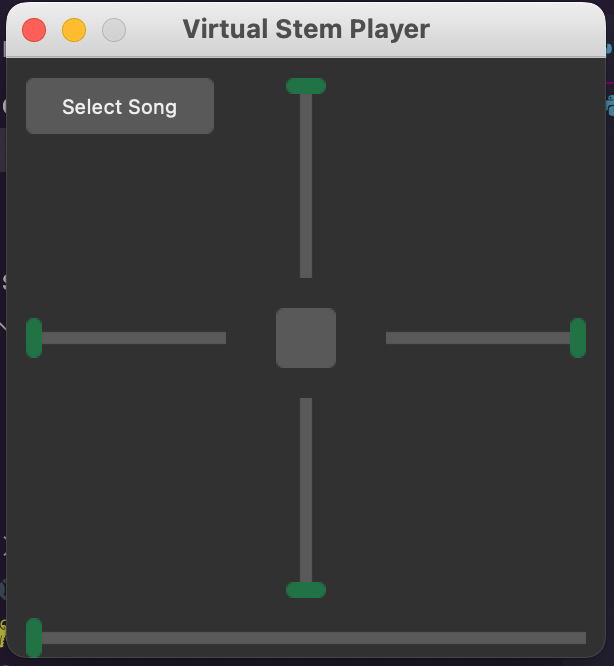

# VirtualStemPlayer

### Description

Split music into stems providing a way listen to music in a different way, with just some elements of a song.

### Requirements

- Python >= 3.10
- Demucs (for stem separation)
- Python-VLC
- Tkinter

```
python -m venv .venv
source .venv/bin/activate
pip install torch torchaudio --index-url https://download.pytorch.org/whl/cpu
pip install -r requirements.txt
python StemPlayer.py
```

> The CPU torch build is installed first so Demucs doesn't pull the multi-gigabyte CUDA wheels.

### Tkinter themes
- Using forest-dark
- Forest-light files included


## Usage



(First use will take some time to first initialize, since it needs to download the separator model)

1. Click on "Select Song"
2. Wait for the confirmation dialog
3. Song will start playing
4. Select Song again loads an already-split song instantly (stems cached in `~/.cache/virtual-stem-player`)
5. Middle button play/pauses song
6. Bottom slider controls music position
7. Press `m` to mute/unmute vocals

Each stem (Vocals, Drums, Bass, Other) has its own volume slider, laid out around the play button.